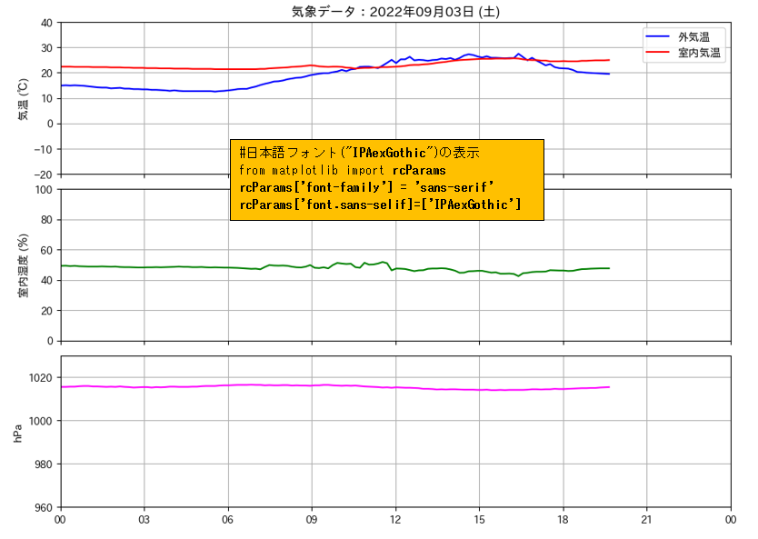

# 01 Matplotlibに日本語フォントを表示する

インストール済みフォント  
※今回利用する日本語フォント: **IPAexGothic**, **IPAexMincho**, **Noto Sans CJK JP**

```bash
$ fc-list | grep "IPAex"
/home/yukio/.local/share/fonts/ipaexm.ttf: IPAex明朝,IPAexMincho:style=Regular
/home/yukio/.local/share/fonts/ipaexg.ttf: IPAexゴシック,IPAexGothic:style=Regular
$ fc-list | grep "Noto Sans CJK JP"
/usr/share/fonts/opentype/noto/NotoSansCJK-Regular.ttc: Noto Sans CJK JP:style=Regular
/usr/share/fonts/opentype/noto/NotoSansCJK-Medium.ttc: Noto Sans CJK JP,Noto Sans CJK JP Medium:style=Medium,Regular
/usr/share/fonts/opentype/noto/NotoSansCJK-DemiLight.ttc: Noto Sans CJK JP,Noto Sans CJK JP DemiLight:style=DemiLight,Regular
/usr/share/fonts/opentype/noto/NotoSansCJK-Thin.ttc: Noto Sans CJK JP,Noto Sans CJK JP Thin:style=Thin,Regular
/usr/share/fonts/opentype/noto/NotoSansCJK-Light.ttc: Noto Sans CJK JP,Noto Sans CJK JP Light:style=Light,Regular
/usr/share/fonts/opentype/noto/NotoSansCJK-Black.ttc: Noto Sans CJK JP,Noto Sans CJK JP Black:style=Black,Regular
/usr/share/fonts/opentype/noto/NotoSansCJK-Bold.ttc: Noto Sans CJK JP:style=Bold
```

## 1. 単一の日本語フォントを設定する

【下記 1-1. pythonコードの出力】

<div>

</div>
<br/>

### 1-1. コードで設定する方法

> (参考URL) 本家サイト  
https://matplotlib.org/3.1.0/gallery/text_labels_and_annotations/font_family_rc_sgskip.html  
**Configuring the font family**

>上記URLのサンプル 
* 1〜4行目のコードをそのまま利用
* 3行目: ['Tahoma'] を自身のPCにインストールされている日本語フォント名に置き換える

```python
from matplotlib import rcParams
rcParams['font.family'] = 'sans-serif'
rcParams['font.sans-serif'] = ['Tahoma']
import matplotlib.pyplot as plt

fig, ax = plt.subplots()
ax.plot([1, 2, 3], label='test')

ax.legend()
plt.show()
```

単一の日本語フォント出力するpythonコード [src/useCjkFont/plotterweather_singlefont.py]

```python
import argparse
import base64
import os
from datetime import datetime, timedelta
from io import BytesIO

import pandas as pd
from matplotlib import rcParams
# 日本語フォントを設定
rcParams['font.family'] = 'sans-serif'
rcParams['font.sans-serif'] = ['IPAexGothic']
import matplotlib.dates as mdates
from matplotlib.figure import Figure
from matplotlib.pyplot import setp


WEATHER_IDX_COLUMN = 'measurement_time'
LABEL_FONTSIZE = 10
GRID_STYLES = {"linestyle": "- -", "linewidth": 1.0}

FMT_JP_DATE = "%Y年%m月%d日"
# datetime.weekday(): 月:0, 火:1, ..., 日:6
LIST_DAY_WEEK_JP = ["月", "火", "水", "木", "金", "土", "日"]


def addDayToString(s_date, add_days=1, fmt_date="%Y-%m-%d"):
    """
    日付文字列に加算日数を加えた日付文字列を出力日付書式に従って返却する
    (例) '2022-08-30' + 2日 -> '2022-09-01'
    :param s_date: 日付文字列
    :param add_days: 加算日数 ※マイナス日数の場合
    :param fmt_date: 出力日付書式
    :return: 出力日付書式の加算日付文字列
    """
    dt = datetime.strptime(s_date, fmt_date)
    dt += timedelta(days=add_days)
    s_next = dt.strftime(fmt_date)
    return s_next


def strDateToDatetimeTime000000(s_date):
    """
    日付文字列の "00:00:00"のdatetimeブジェクトを返却する
    :param s_date: 日付文字列
    :return: datetimeブジェクト
    """
    return datetime.strptime(s_date + " 00:00:00", "%Y-%m-%d %H:%M:%S")


def datetimeToJpDateWithWeek(cur_datetime):
    """
    日本語の曜日を含む日付を返却する
    (例) 2022-09-09 -> 2022-09-09 (金)
    :param cur_datetime:日付
    :return: 日本語の曜日を含む日付
    """
    s_date = cur_datetime.strftime(FMT_JP_DATE)
    idx_week = cur_datetime.weekday()
    return "{} ({})".format(s_date, LIST_DAY_WEEK_JP[idx_week])


def _axesTemperatureSetting(ax, df, titleDate):
    """
    温度サブプロット(axes)にタイトル、軸・軸ラベルを設定し、
    DataFrameオプジェクトの外気温・室内気温データをプロットする
    :param ax:温度サブプロット(axes)
    :param df:DataFrameオプジェクト
    :param titleDate: タイトル日付文字列
    """
    ax.plot(df[WEATHER_IDX_COLUMN], df["temp_out"], color="blue", marker="", label="外気温")
    ax.plot(df[WEATHER_IDX_COLUMN], df["temp_in"], color="red", marker="", label="室内気温")
    ax.set_ylim([-20, 40])
    ax.set_ylabel("気温 (℃)", fontsize=LABEL_FONTSIZE)
    ax.legend(loc="best")
    ax.set_title("気象データ：{}".format(titleDate))
    # Hide xlabel
    ax.label_outer()
    ax.grid(GRID_STYLES)


def _axesHumidSetting(ax, df):
    """
    湿度サブプロット(axes)に軸・軸ラベルを設定し、DataFrameオプジェクトの室内湿度データをプロットする
    :param ax:湿度サブプロット(axes)
    :param df:DataFrameオプジェクト
    """
    ax.plot(df[WEATHER_IDX_COLUMN], df["humid"], color="green", marker="")
    ax.set_ylim([0, 100])
    ax.set_ylabel("室内湿度 (％)", fontsize=LABEL_FONTSIZE)
    # Hide xlabel
    ax.label_outer()
    ax.grid(GRID_STYLES)


def _axesPressureSetting(ax, df):
    """
    気圧サブプロット(axes)に軸・軸ラベルを設定し、DataFrameオプジェクトの気圧データをプロットする
    :param ax:湿度サブプロット(axes)
    :param df:DataFrameオプジェクト
    """
    ax.plot(df[WEATHER_IDX_COLUMN], df["pressure"], color="fuchsia", marker="")
    # 気圧 (hPa]: 軸ラベルは時間 (00,03,06,09,12,15,18,21,翌日の00)
    ax.xaxis.set_major_formatter(mdates.DateFormatter("%H"))
    ax.set_ylim([960, 1030])
    ax.set_ylabel("hPa", fontsize=LABEL_FONTSIZE)
    ax.grid(GRID_STYLES)


def gen_plot_imagetag(csv_file, str_today="now"):
    """
    気象データCSVファイルからMatplotlib画像を生成し、img タグを含むHTML文字列を返却する
    :param csv_file:CSVファイルパス
    :param str_today:当日を表す日付文字列: "now"なら今日, それ以外は有効な日付文字列(YYYY-mm-DD)
    :return: img タグを含むhtml文字列
    """
    # CSVファイルからDataFrameを生成
    df = pd.read_csv(csv_file,
                     header=0,
                     parse_dates=[WEATHER_IDX_COLUMN],
                     names=[WEATHER_IDX_COLUMN, 'temp_out', 'temp_in', 'humid', 'pressure']
                     )
    # タイムスタンプをデータフレームのインデックスに設定
    df.index = df[WEATHER_IDX_COLUMN]

    if str_today == "now":
        first_datetime = datetime.now()
    else:
        # 指定された日付="YYYY-MM-DD"
        first_datetime = datetime.strptime(str_today, "%Y-%m-%d")
    # 当日の日付文字列 ※一旦 dateオブジェクトに変換して"年月日"を取得
    s_first_date = first_datetime.date().isoformat()
    # 表示範囲：当日の "00:00:00" から
    x_day_min = strDateToDatetimeTime000000(s_first_date)
    # 翌日の "00:00:00" 迄
    s_nextday = addDayToString(s_first_date)
    x_day_max = strDateToDatetimeTime000000(s_nextday)
    # タイトル用の日本語日付(曜日)
    title_date = datetimeToJpDateWithWeek(first_datetime)

    # 描画領域生成: 11 x 8インチ
    fig = Figure(figsize=[11, 8])
    # x軸を共有する3行1列のサププロット領域生成
    (ax_temp, ax_humid, ax_pressure) = fig.subplots(3, 1, sharex=True)

    # サブプロット間の間隔を変更する
    fig.subplots_adjust(wspace=0.1, hspace=0.1)
    # 軸ラベルのフォントサイズを設定
    for ax in [ax_temp, ax_humid, ax_pressure]:
        setp(ax.get_xticklabels(), fontsize=9)
        setp(ax.get_yticklabels(), fontsize=9)

    # 1日データx軸の範囲: 当日 00時 から 翌日 00時
    for ax in [ax_temp, ax_humid, ax_pressure]:
        ax.set_xlim([x_day_min, x_day_max])

    # サブプロットの設定
    # 1.外気温と室内気温
    _axesTemperatureSetting(ax_temp, df, title_date)
    # 2.室内湿度
    _axesHumidSetting(ax_humid, df)
    # 3.気圧
    _axesPressureSetting(ax_pressure, df)

    # 画像をバイトストリームに溜め込みそれをbase64エンコードしてレスポンスとして返す
    buf = BytesIO()
    fig.savefig(buf, format="png", bbox_inches="tight")
    data = base64.b64encode(buf.getbuffer()).decode("ascii")
    img_tag = ''.format(data)
    return img_tag


if __name__ == '__main__':
    parser = argparse.ArgumentParser()
    parser.add_argument("--csv-path", type=str, required=True, help="Weather data csv file of absolute path.")
    parser.add_argument("--output-dir", type=str, help="Output HTML directory.")
    parser.add_argument("--today-date", type=str, help="CSV data date: 'now' or 'YYYY-mm-DD'.")
    args = parser.parse_args()

    csv_file = os.path.join(os.path.expanduser(args.csv_path))
    if not os.path.exists(csv_file):
        print("{} is not found!".format(csv_file))
        exit(1)

    file_name = os.path.basename(csv_file)
    name_only = os.path.splitext(file_name)[0]
    html_name = name_only + "_singleFont.html"
    if args.output_dir is None:
        save_dir = os.path.dirname(csv_file)
        html_path = os.path.join(save_dir, html_name)
    else:
        if not not os.path.exists(args.output_dir) or not os.path.isdir(args.output_dir):
            print("{} is not valid output directory!".format(args.output_dir))
            exit(1)
        html_path = os.path.join(args.output_path, html_name)

    today_date = args.today_date
    if today_date is None or (today_date is not None and today_date == 'now'):
        img_tag = gen_plot_imagetag(csv_file)
    else:
        try:
            datetime.strptime(today_date, "%Y-%m-%d")
        except ValueError:
            print("today-date is 'YYYY-MM-DD'")
            exit(1)
        img_tag = gen_plot_imagetag(csv_file, str_today=today_date)

    with open(html_path, 'w') as fp:
        fp.write(img_tag)
    print("Saved: {}".format(html_path))
```

サンプルの気象データcsv [example_datas/csv/weather_20220903.csv]  
* PCのDownloadsディレクトリにサブディレクトリ csv を作成する
* リポジトリのサンプルデータのCSVをPCの~/Downloads/csv/にコピーする
* サンプルの気象データは **2022-09-03** の観測データ
* sourceコマンドで py_matplotlib 仮想環境に入り、plotterweather_singlefont.pyを実行  
  [引数の指定]  
**--csv-path** ~/Downloads/csv/**weather_20220903.csv**  
**--today-date 2022-09-03**  

```bash
(py_matplotlib) $ python plotterweather_singlefont.py --csv-path ~/Downloads/csv/weather_20220903.csv --today-date 2022-09-03
Saved: /home/yukio/Downloads/csv/weather_20220903_singleFont.html
```

### 1-2. matplotlibrc ファイルを利用する方法

> (参考URL) 本家サイト  
https://matplotlib.org/stable/tutorials/introductory/customizing.html  
Customizing Matplotlib with style sheets and rcParams  
   **The matplotlibrc file**

(1) matplotlibrc ファイルの格納箇所の確認

```bash
(py_matplotlib) $ python
Python 3.7.5 (default, Dec  9 2021, 17:04:37) 
[GCC 8.4.0] on linux
Type "help", "copyright", "credits" or "license" for more information.
>>> import matplotlib
>>> matplotlib.matplotlib_fname()
'/home/yukio/py_venv/py_matplotlib/lib/python3.7/site-packages/matplotlib/mpl-data/matplotlibrc'
>>> quit()
``` 

(2) matplotlibrcファイルを ~/Documents にコピーする

```bash
(py_matplotlib) $ cp ~/py_venv/py_matplotlib/lib/python3.7/site-packages/matplotlib/mpl-data/matplotlibrc ~/Documents
```

(3) エディタで matplotlibrcファイルを開き、フォント関連設定箇所を編集する  

(3)-1.下記は 13〜20行目 の抜粋  
編集後ファイルの格納箇所: 実行環境が Linux なので **$HOME/.config/matplotlib/matplotlibrc** コピー

```vim
## If you wish to change your default style, copy this file to one of the
## following locations:
##     Unix/Linux:
##         $HOME/.config/matplotlib/matplotlibrc OR
##         $XDG_CONFIG_HOME/matplotlib/matplotlibrc (if $XDG_CONFIG_HOME is set)
##     Other platforms:
##         $HOME/.matplotlib/matplotlibrc
## and edit that copy.
```

(3)-2. 編集箇所は 257〜266行目

* #font.family:  sans-serif       <<- 先頭の"#"を外す
* #font.serif: DejaVu Serif,      <<- 先頭の"#"を外し、"DejaVu Serif" の前に **IPAexMincho** を追加
* ##font.sans-serif: DejaVu Sans, <<- 先頭の"#"を外し、"DejaVu Sans" の前に **IPAexGothic** を追加

[修正前]

```vim
#font.family:  sans-serif
#font.style:   normal
#font.variant: normal
#font.weight:  normal
#font.stretch: normal
#font.size:    10.0

# .cache/matplotlib/fontlist-v330.json
#font.serif:      DejaVu Serif, Bitstream Vera Serif, Computer Modern Roman, New Century Schoolbook, Century Schoolbook L, Utopia, ITC Bookman, Bookman, Nimbus Roman No9 L, Times New Roman, Times, Palatino, Charter, serif
#font.sans-serif: DejaVu Sans, Bitstream Vera Sans, Computer Modern Sans Serif, Lucida Grande, Verdana, Geneva, Lucid, Arial, Helvetica, Avant Garde, sans-serif
```

[修正後]

```vim
font.family:  sans-serif
#font.style:   normal
#font.variant: normal
#font.weight:  normal
#font.stretch: normal
#font.size:    10.0

# .cache/matplotlib/fontlist-v330.json
font.serif: IPAexMincho, DejaVu Serif, Bitstream Vera Serif, Computer Modern Roman, New Century Schoolbook, Century Schoolbook L, Utopia, ITC Bookman, Bookman, Nimbus Roman No9 L, Times New Roman, Times, Palatino, Charter, serif
font.sans-serif: IPAexGothic, DejaVu Sans, Bitstream Vera Sans, Computer Modern Sans Serif, Lucida Grande, Verdana, Geneva, Lucid, Arial, Helvetica, Avant Garde, sans-serif
```

(4) 編集保存後 $HOME/.config/matplotlib にコピーします

```bash
$ mkdir -p ~/.config/matplotlib
$ cp matplotlibrc ~/.config/matplotlib
```

(5) 下記箇所をコメントアウトするか削除します
```
# from matplotlib import rcParams
# rcParams['font.family'] = 'sans-serif'
# rcParams['font.sans-serif'] = ['IPAexGothic']
```

これで再度実行すると 1-1 と同一の画像を含むHTMLが出力されます。
<br/><br/>


## 2. 複数の日本語フォントを設定する

下記 2-1 pythonコードの出力例

<div>

</div>
<br/>

### 2-1. タイトル、ラベル、軸ラベルに任意のフォントを割り当てる方法  

> (参考URL)   
https://matplotlib.org/stable/gallery/text_labels_and_annotations/text_fontdict.html  
**Controlling style of text and labels using a dictionary**  
https://matplotlib.org/stable/api/legend_api.html  
**matplotlib.legend**  
prop : None or matplotlib.font_manager.FontProperties or dict  
https://pythonguides.com/matplotlib-set_xticklabels/  
**Matplotlib set_xticklabels**


複数の日本語フォント出力するpythonコード [src/useCjkFont/plotterweather_multifont.py]

```python
import argparse
import base64
import os
from datetime import datetime, timedelta
from io import BytesIO

import pandas as pd
# 本番環境ではjsonファイルに保存
PLOT_CONF = {
    "font.family": "sans-serif",
    "fonts.sans": ["IPAexGothic","Noto Sans CJK JP","FreeSans"],
    "fonts.serif": ["IPAexMincho"],
    "label.sizes": [10, 9, 9],
    "ylim": {
        "temp": [-20, 40],
        "pressure": [960, 1030]
    }
}
import matplotlib.dates as mdates
from matplotlib.figure import Figure
from matplotlib.pyplot import setp


WEATHER_IDX_COLUMN = 'measurement_time'
LABEL_FONTSIZE = 10
GRID_STYLES = {"linestyle": "- -", "linewidth": 1.0}
# 軸ラベルのフォントサイズを設定
label_fontsize, ticklabel_fontsize, ticklable_date_fontsize = PLOT_CONF["label.sizes"]

FMT_JP_DATE = "%Y年%m月%d日"
# datetime.weekday(): 月:0, 火:1, ..., 日:6
LIST_DAY_WEEK_JP = ["月", "火", "水", "木", "金", "土", "日"]


def addDayToString(s_date, add_days=1, fmt_date="%Y-%m-%d"):
    """
    日付文字列に加算日数を加えた日付文字列を出力日付書式に従って返却する
    (例) '2022-08-30' + 2日 -> '2022-09-01'
    :param s_date: 日付文字列
    :param add_days: 加算日数 ※マイナス日数の場合
    :param fmt_date: 出力日付書式
    :return: 出力日付書式の加算日付文字列
    """
    dt = datetime.strptime(s_date, fmt_date)
    dt += timedelta(days=add_days)
    s_next = dt.strftime(fmt_date)
    return s_next


def strDateToDatetimeTime000000(s_date):
    """
    日付文字列の "00:00:00"のdatetimeブジェクトを返却する
    :param s_date: 日付文字列
    :return: datetimeブジェクト
    """
    return datetime.strptime(s_date + " 00:00:00", "%Y-%m-%d %H:%M:%S")


def datetimeToJpDateWithWeek(cur_datetime):
    """
    日本語の曜日を含む日付を返却する
    (例) 2022-09-09 -> 2022-09-09 (金)
    :param cur_datetime:日付
    :return: 日本語の曜日を含む日付
    """
    s_date = cur_datetime.strftime(FMT_JP_DATE)
    idx_week = cur_datetime.weekday()
    return "{} ({})".format(s_date, LIST_DAY_WEEK_JP[idx_week])


def _axesTemperatureSetting(ax, df, titleDate):
    """
    温度サブプロット(axes)にタイトル、軸・軸ラベルを設定し、
    DataFrameオプジェクトの外気温・室内気温データをプロットする
    :param ax:温度サブプロット(axes)
    :param df:DataFrameオプジェクト
    :param titleDate: タイトル日付文字列
    """
    ax.plot(df[WEATHER_IDX_COLUMN], df["temp_out"], color="blue", marker="", label="外気温")
    ax.plot(df[WEATHER_IDX_COLUMN], df["temp_in"], color="red", marker="", label="室内気温")
    # タイトル、ラベル、軸ラベルに任意のフォントを割り当てる
    # 気温のラベルフォント "IPAexGothic"
    ylabel_fontdict = {
        'family': PLOT_CONF["fonts.sans"][0], 'size': label_fontsize+2,
    }
    ax.set_ylabel("気温 (℃)", fontdict=ylabel_fontdict)
    # 温度の軸ラベルのフォント "FreeSans"
    #  軸の範囲 PLOT_CONF[temp]=[-20, 40] で 10℃間隔, 40を含めるため +10
    tick_fontdict = {
        'family': PLOT_CONF["fonts.sans"][2], 'size': label_fontsize-1,
        'weight':'bold'
    }
    yticks = [*range(PLOT_CONF["ylim"]["temp"][0], PLOT_CONF["ylim"]["temp"][1] + 10, 10)]
    # 軸本体
    ax.set_yticks(yticks)
    # 軸ラベル
    ax.set_yticklabels(yticks, fontdict=tick_fontdict)
    # 凡例フォント "Noto Sans CJK JP"
    legend_fontdict = {'family': PLOT_CONF["fonts.sans"][1], 'size': label_fontsize-1}
    ax.legend(loc="best", prop=legend_fontdict)
    # タイトルフォント "IPAexMincho"
    title_fontdict = {
        'family': PLOT_CONF["fonts.serif"][0], 'size': label_fontsize+3,
    }
    ax.set_title("気象データ：{}".format(titleDate), fontdict=title_fontdict)
    # Hide xlabel
    ax.label_outer()
    ax.grid(GRID_STYLES)


def _axesHumidSetting(ax, df):
    """
    湿度サブプロット(axes)に軸・軸ラベルを設定し、DataFrameオプジェクトの室内湿度データをプロットする
    :param ax:湿度サブプロット(axes)
    :param df:DataFrameオプジェクト
    """
    ax.plot(df[WEATHER_IDX_COLUMN], df["humid"], color="green", marker="")
    ax.set_ylim([0, 100])
    # 湿度のラベルフォント "IPAexGothic"
    ylabel_fontdict = {
        'family': PLOT_CONF["fonts.sans"][0], 'size': label_fontsize+2,
    }
    ax.set_ylabel("室内湿度 (％)", fontdict=ylabel_fontdict)
    # Hide xlabel
    ax.label_outer()
    ax.grid(GRID_STYLES)


def _axesPressureSetting(ax, df):
    """
    気圧サブプロット(axes)に軸・軸ラベルを設定し、DataFrameオプジェクトの気圧データをプロットする
    :param ax:湿度サブプロット(axes)
    :param df:DataFrameオプジェクト
    """
    ax.plot(df[WEATHER_IDX_COLUMN], df["pressure"], color="fuchsia", marker="")
    # 軸ラベルは時間 (00,03,06,09,12,15,18,21,翌日の00)
    ax.xaxis.set_major_formatter(mdates.DateFormatter("%H"))
    ax.set_ylim(PLOT_CONF["ylim"]["pressure"])
    # 気圧のラベルフォント "FreeSans" ※ラベルが非漢字
    ylabel_fontdict = {
        'family': PLOT_CONF["fonts.sans"][2], 'size': label_fontsize+1,
    }
    ax.set_ylabel("hPa", fontdict=ylabel_fontdict)
    ax.grid(GRID_STYLES)


def gen_plot_imagetag(csv_file, str_today="now"):
    """
    気象データCSVファイルからMatplotlib画像を生成し、img タグを含むHTML文字列を返却する
    :param csv_file:CSVファイルパス
    :param str_today:当日を表す日付文字列: "now"なら今日, それ以外は有効な日付文字列(YYYY-mm-DD)
    :return: img タグを含むhtml文字列
    """
    # CSVファイルからDataFrameを生成
    df = pd.read_csv(csv_file,
                     header=0,
                     parse_dates=[WEATHER_IDX_COLUMN],
                     names=[WEATHER_IDX_COLUMN, 'temp_out', 'temp_in', 'humid', 'pressure']
                     )
    # タイムスタンプをデータフレームのインデックスに設定
    df.index = df[WEATHER_IDX_COLUMN]

    if str_today == "now":
        first_datetime = datetime.now()
    else:
        # 指定された日付="YYYY-MM-DD"
        first_datetime = datetime.strptime(str_today, "%Y-%m-%d")
    # 当日の日付文字列 ※一旦 dateオブジェクトに変換して"年月日"を取得
    s_first_date = first_datetime.date().isoformat()
    # 表示範囲：当日の "00:00:00" から
    x_day_min = strDateToDatetimeTime000000(s_first_date)
    # 翌日の "00:00:00" 迄
    s_nextday = addDayToString(s_first_date)
    x_day_max = strDateToDatetimeTime000000(s_nextday)
    # タイトル用の日本語日付(曜日)
    title_date = datetimeToJpDateWithWeek(first_datetime)

    # 描画領域生成: 11 x 8インチ
    fig = Figure(figsize=[11, 8])
    # x軸を共有する3行1列のサププロット領域生成
    (ax_temp, ax_humid, ax_pressure) = fig.subplots(3, 1, sharex=True)

    # サブプロット間の間隔を変更する
    fig.subplots_adjust(wspace=0.1, hspace=0.1)
    # 軸ラベルのフォントサイズを設定
    for ax in [ax_temp, ax_humid, ax_pressure]:
        setp(ax.get_xticklabels(), fontsize=ticklable_date_fontsize)
        setp(ax.get_yticklabels(), fontsize=ticklabel_fontsize)

    # 1日データx軸の範囲: 当日 00時 から 翌日 00時
    for ax in [ax_temp, ax_humid, ax_pressure]:
        ax.set_xlim([x_day_min, x_day_max])

    # サブプロットの設定
    # 1.外気温と室内気温
    _axesTemperatureSetting(ax_temp, df, title_date)
    # 2.室内湿度
    _axesHumidSetting(ax_humid, df)
    # 3.気圧
    _axesPressureSetting(ax_pressure, df)

    # 画像をバイトストリームに溜め込みそれをbase64エンコードしてレスポンスとして返す
    buf = BytesIO()
    fig.savefig(buf, format="png", bbox_inches="tight")
    data = base64.b64encode(buf.getbuffer()).decode("ascii")
    img_tag = ''.format(data)
    return img_tag


if __name__ == '__main__':
    parser = argparse.ArgumentParser()
    parser.add_argument("--csv-path", type=str, required=True, help="Weather data csv file of absolute path.")
    parser.add_argument("--output-dir", type=str, help="Output HTML directory.")
    parser.add_argument("--today-date", type=str, help="CSV data date: 'now' or 'YYYY-mm-DD'.")
    args = parser.parse_args()

    csv_file = os.path.join(os.path.expanduser(args.csv_path))
    if not os.path.exists(csv_file):
        print("{} is not found!".format(csv_file))
        exit(1)

    file_name = os.path.basename(csv_file)
    name_only = os.path.splitext(file_name)[0]
    html_name = name_only + "_multiFonts.html"
    if args.output_dir is None:
        save_dir = os.path.dirname(csv_file)
        html_path = os.path.join(save_dir, html_name)
    else:
        if not not os.path.exists(args.output_dir) or not os.path.isdir(args.output_dir):
            print("{} is not valid output directory!".format(args.output_dir))
            exit(1)
        html_path = os.path.join(args.output_path, html_name)

    today_date = args.today_date
    if today_date is None or (today_date is not None and today_date == 'now'):
        img_tag = gen_plot_imagetag(csv_file)
    else:
        try:
            datetime.strptime(today_date, "%Y-%m-%d")
        except ValueError:
            print("today-date is 'YYYY-MM-DD'")
            exit(1)
        img_tag = gen_plot_imagetag(csv_file, str_today=today_date)

    with open(html_path, 'w') as fp:
        fp.write(img_tag)
    print("Saved: {}".format(html_path))
```

plotterweather_multifonts.py を実行

```bash
(py_matplotlib) $ python plotterweather_multifonts.py --csv-path ~/Downloads/csv/weather_20220903.csv --today-date 2022-09-03
Saved: /home/yukio/Downloads/csv/weather_20220903_multiFonts.html
```

以上