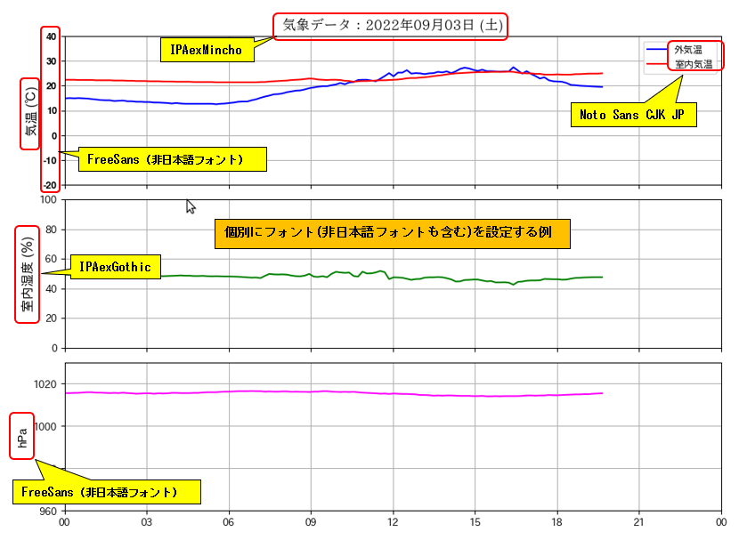

# Matplotlib & Pandas know-how

【開発環境】Ubuntu 20.04

2023-05-31 Ubuntu 18.04 が End of Life になったのに伴い 20.04 にアップグレード。   
Python3のバージョン も 3.7.x から 3.8.x に変わっています。

```bash
$ lsb_release -a
No LSB modules are available.
Distributor ID:	Ubuntu
Description:	Ubuntu 20.04.6 LTS
Release:	20.04
Codename:	focal

$ python3 -V
Python 3.8.10
```

【本番環境】ラスパイ４ ※気象観測データ、健康管理データの可視化サーバーとして利用

<div>

</div>

```bash
pi@raspi-4:~ $ lsb_release -a
No LSB modules are available.
Distributor ID:	Debian
Description:	Debian GNU/Linux 11 (bullseye)
Release:	11
Codename:	bullseye

pi@raspi-4:~ $ python3 -V
Python 3.9.2
```

こちらは運用中の気象観測データの可視化画像
<div>

</div>
<br/>


## ソースとpython仮想環境, 使用ライブラリ

| ソース | 内容 | python仮想環境 | ライブラリ |
|--------|------|----------------|------------|
| (1) useCjkFont | 日本語フォントの表示 | py_matplotlib | matplotlib, pandas |
| (2) healthcare | 健康管理データの可視化 | py_healthcare_tool | matplotlib, pandas, sqlalchemy, psycopg2-binary |


## python仮想環境の作成

* ホームにサブディレクトリ py_venv を作成し、その中に Python仮想環境を作成  

(1) 日本語フォント表示用: py_matplotlib
```bash
~/py_venv$ python3 -m venv py_matplotlib
# sourceコマンドで仮想環境に入り pip 自体をアップデート
~/py_venv$ source py_matplotlib/bin/activate
(py_matplotlib) ~/py_venv$ pip install -U pip
# Matplotlib, Pandasライブラリをインストール
(py_matplotlib) ~/py_venv$ pip install matplotlib pandas
```

(2) 健康管理データの可視化用: py_healthcare_tool
```
~/py_venv$ python3 -m venv py_healthcare_tool
~/py_venv$ source py_matplotlib/bin/activate
# Matplotlib, Pandas, SQLAlchemy, psycopg2ライブラリをインストール
(py_healthcare_tool) ~/py_venv$ pip install matplotlib pandas sqlalchemy psycopg2-binary 
```

## 3. Matplotlibに日本語フォント表示

```
src/useCjkFont/
├─ csv
│   └─ weather_20220903.csv     # サンプルデータ ※2022年09月03日データ
├─ plotterweather_multifont.py   # 複数日本語フォント出力スクリプト
└─ plotterweather_singlefont.py  # 単一日本語フォント出力スクリプト
```

### 3-1. 単一日本語フォントを設定した出力例
<div>

</div>

### 3-2. 複数の日本語フォントを設定した出力例
<div>

</div>

>コードの説明は下記コンテンツ(Github Pages)をご覧ください  
https://pipito-yukio.github.io/matplotlib_knowhow/01_useCjkFont.html  

## 4. 健康管理アプリ登録データの可視化

```
src/healthcare/
├─ PlotBloodPressBar_2_sqlalchemy_month.py    # 血圧測定データプロットスクリプト (SQLAlchemy版) 
├─ PlotBloodPressBar_3_pandas_month.py        # 血圧測定データプロットスクリプト (pandas版) 
├─ PlotSleepManBar2Plot_3_pandas_month.py     # 睡眠管理データプロットスクリプト (SQLAlchemy版) 
├─ PlotSleepManBar2Plot_4_sqlalchemy_month.py # 睡眠管理データプロットスクリプト (pandas版)
├─ PlotTwinHistSleepMan_pandasSql.py          # 睡眠管理データ度数表プロット (SQLAlchemy + pandas版)
├─ conf
│   └─ db_healthcare.json                     # Postgresql用接続情報
├─ datas
│   └─ csv
│       ├─ blood_pressure.csv          # 血圧測定データ 2023-01〜2023-04 の4ヶ月分の実データ
│       ├─ blood_pressure_202303.csv   # 血圧測定データ ※欠損データ確認用テストデータ
│       ├─ nocturia_factors.csv        # 夜間頻尿要因データ 2023-01〜2023-04 の4ヶ月分
│       ├─ nocturia_factors_202303.csv # 夜間頻尿要因データ ※欠損データ確認用テストデータ
│       ├─ sleep_management.csv        # 睡眠管理データ 2023-01〜2023-04 の4ヶ月分
│       └─ sleep_management_202303.csv # 睡眠管理データ ※欠損データ確認用テストデータ
├── logs                                              # 各スクリプトの実行ログ
│   ├── PlotBloodPressBar_3_pandas_month.log
│   ├── PlotSleepManBar2Plot_3_pandas_month.log
│   ├── PlotSleepManBar2Plot_4_sqlalchemy_month.log
│   └── PlotTwinHistSleepMan_pandasSql.log
├── screen_shots                                      # 各スクリプトの実行後のスクリーンショット 
│   ├── PlotSleepManBar2Plot_3_pandas_month.png
│   ├── PlotSleepManBar2Plot_4_sqlalchemy_month.png
│   └── PlotTwinHistSleepMan_pandasSql.png
├── sql
│   ├── 10_createdb.sql       # 健康管理データベース作成クエリー (PostgreSQL 12)  
│   └── 11_createtable.sql    # 健康管理テーブル作成クエリー
└── util
    ├── __init__.py
    ├── date_util.py
    └── file_util.py
```

### 4-1. (1) 睡眠管理データの可視化

Androidアプリの睡眠管理データ入力とアプリに提供予定の可視化画像

- この可視化画像のコーディングはpandasライブラリでは結構大変です。
- 可視化だけなら SQLAlchemyを使ったほうが容易ですが、月間データの場合は統計情報も計算したいので Flaskアプリで実装する場合は SQLAlchemy + pandas を組み合わせることになります。

>コードの詳しい説明は下記コンテンツ(Github Pages)をご覧ください  
https://pipito-yukio.github.io/matplotlib_knowhow/11_plotSleepManBar_1_pandas.html

<div>

</div>
<br/>

### 4-1. (2) 睡眠管理データをpandasで度数データに加工して可視化

- 右側の度数グラフ画像は SQLAlchemy + pandas ライブラリで出力しています。
- こうしたデータの加工が必要な場合は pandas ライブラリを使用するほうが実装がかんたんになります。

>コードの詳しい説明は下記コンテンツ(Github Pages)をご覧ください  
https://pipito-yukio.github.io/matplotlib_knowhow/13_plotTwinHistSleepMan_1_pandas.html

<div>

</div>
<br/>

### 4-2. 血圧測定データの可視化

Androidアプリの血圧測定(午前・午後)データ入力と可視化画像

【スクリプト名】 PlotBloodPressBar_2_xxxxx_month.py

<div>

</div>
<br/>
